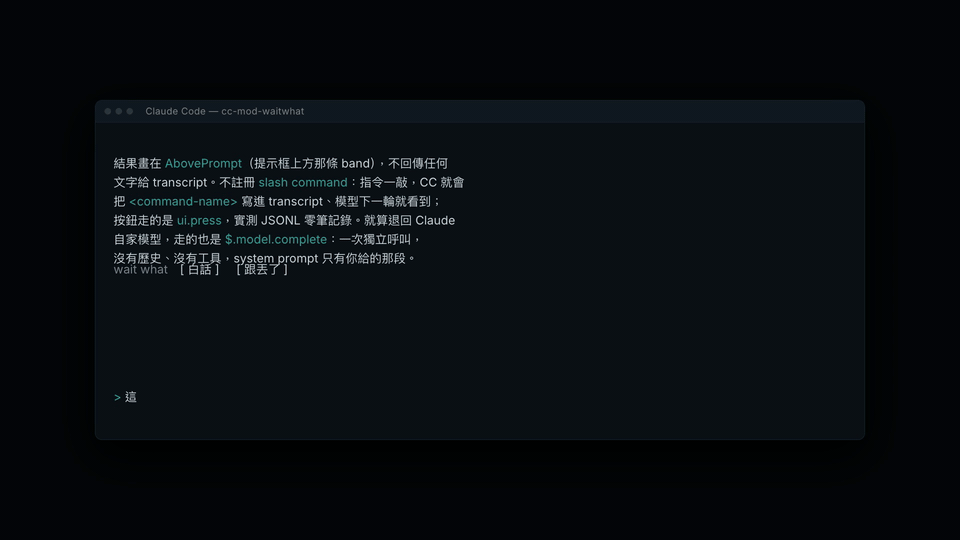

# cc-mod-waitwhat

在 Claude Code 提示框上方重講它剛剛說的話。重講內容不進 transcript，模型看不到。

重講畫在哪裡看終端機：一般終端機畫在提示框上方那條 band；**在 [Orca](https://orca.computer) 裡則是拆一格終端出來跑 `ww`**，band 只留一行狀態。兩種都不碰 transcript。

這是 [cc-sidecar-waitwhat](https://github.com/GGGODLIN/cc-sidecar-waitwhat) 的 Claude Mods 版：sidecar 跑在 CC 外面、讀 JSONL；這個 mod 跑在 CC 裡面、讀引擎給的對話，換來不用切終端機、不用選 session。兩邊共用同一組環境變數與 prompt 覆寫檔。



```
┌ transcript
│  …
├ band
│  wait what [ 白話 ] [ 跟丟了 ] [ 清除 ]
│  ── 白話 · 往回 1 turn  (送出 201 字 → http:gemini-3.8-flash-high · 6.5s)
│  ╭──────────────────────────────────────────────╮
│  │ git stash 是 Git 的「臨時置物櫃」…            │
│  ╰──────────────────────────────────────────────╯
├ prompt
│  ❯
```

| 按鈕 | 做什麼 | 送什麼給模型 | 在 Orca 裡 |
|---|---|---|---|
| `白話` | 看不懂這一輪，白話重講 | 最後一個 turn（你問一次加上 CC 那一輪的全部回應，工具呼叫不拆開算） | 隔壁那格跑 `ww 1` |
| `跟丟了` | 跟丟了，重講整段脈絡 | 整個 session 的對話與工具紀錄 | 隔壁那格跑 `ww` |

## 為什麼模型看不到

- 結果畫在 `AbovePrompt`（提示框上方那條 band），不回傳任何文字給 transcript。
- 不註冊 slash command。`/wait-what` 這類指令一敲，CC 就會把 `<command-name>` 寫進 transcript、模型下一輪就看到；按鈕走的是 `ui.press`，實測 JSONL 零筆記錄。
- 就算退回 Claude 自家模型，走的也是 `$.model.complete`：一次獨立呼叫，沒有歷史、沒有工具，system prompt 只有你給的那段。

## 在 Orca 底下：重講跑到隔壁那格

偵測到 `ORCA_TERMINAL_HANDLE` 就換一條路：按鈕不再自己叫模型，而是拆一格終端出來跑 [cc-sidecar-waitwhat](https://github.com/GGGODLIN/cc-sidecar-waitwhat) 的 `ww`。

```
┌ Orca tab ─────────────────┬───────────────────────────┐
│ CC                        │ ww 1                      │
│  …                        │                           │
│  wait what [白話] [跟丟了] │ git stash 是 Git 的臨時    │
│  ── 白話 · 已丟給旁邊那格  │ 置物櫃…                    │
│  ❯                        │ ❯                         │
└───────────────────────────┴───────────────────────────┘
```

按下去的瞬間右邊那格才長出來，重講留在那裡，CC 這邊只多一行狀態。

不用傳 session id。`ww` 會讀自己那格的 `ORCA_TAB_ID`，掃行程的環境變數找到同一個 tab 的 CC，自己認出要重講哪一支。

這條路比 band 更乾淨：mod 不碰 `$.session.messages()`、也不碰 `$.model`，CC 這個殼連重講內容都沒經手，只知道你按了按鈕、然後開了一格終端。band 只留一行狀態。

第二次按會重用同一格（`orca terminal send`），不會愈開愈多。那格被你關掉就重拆一格。`orca` 指令失敗、或根本不在 Orca 裡，就退回原本畫在 band 的做法，並在標題行寫出退回原因。

兩邊共用同一份快取，所以剛在 band 看過的那段，換到隔壁那格不會再花一次錢。

## 誰提供這次的重講

跟 sidecar 同一條鏈：先試 `cmd`，不行換 `http`，都不行才退回 Claude 自家模型。每次跑完，標題行會寫實際來源，退回時多一行原因。

| 來源 | 是什麼 | 設定 |
|---|---|---|
| `cmd` | 一個 shell 指令，prompt 從 stdin 進、答案從 stdout 出 | `SIDECAR_CMD`；沒設就跳過 |
| `http` | 任何吃 OpenAI 格式 `/v1/chat/completions` 的端點 | `SIDECAR_PROXY`（預設 `http://127.0.0.1:8317/v1/chat/completions`）、`SIDECAR_MODEL`（預設 `gemini-3.8-flash-high`）、`SIDECAR_API_KEY`（沒設就讀 `~/.cli-proxy-api/config.yaml` 的第一把 `api-keys`） |
| `claude` | `$.model.complete`，走 session 自己的憑證 | `WW_MODEL`（預設 `haiku`） |

`SIDECAR_SOURCE=cmd` 或 `http` 只試那一條，失敗直接退回 `claude`。指令照 shell 規則切參數，但不經過 shell 執行，不能寫 pipe 或重導向。

## 需求

- Claude Code 2.1.267 以上，並開 `CLAUDE_CODE_ENABLE_FUNCTION_HOOKS=1`
- 只在 terminal 有效。桌面版和手機版沒有 band。

## 裝

接進所有 session：

```bash
claude plugin marketplace add /path/to/cc-mod-waitwhat
claude plugin install cc-mod-waitwhat@cc-mod-waitwhat --scope user
```

再把 `CLAUDE_CODE_ENABLE_FUNCTION_HOOKS` 放進 `~/.claude/settings.json` 的 `env`：

```json
{ "env": { "CLAUDE_CODE_ENABLE_FUNCTION_HOOKS": "1" } }
```

改了原始碼後跑 `claude plugin update cc-mod-waitwhat@cc-mod-waitwhat`，安裝的是複本。

只試一次、不裝：

```bash
CLAUDE_CODE_ENABLE_FUNCTION_HOOKS=1 claude --plugin-dir /path/to/cc-mod-waitwhat
```

按鈕用滑鼠點，或 `ctrl+x tab` 把焦點移進 band、左右鍵選、Enter 按、Esc 回到輸入框。`ctrl+x ctrl+a` 收合整條 band。

## 快取

重講結果寫進 `~/.cache/cc-sidecar-waitwhat.json`，跟 sidecar 共用同一套 key：模式加上標準化後的 user／assistant 對話，再算 SHA-256。key 不含入口、模型來源或兩邊不同的 payload 包裝，所以按鈕與 terminal `ww` 會互相命中；哪邊先產生答案，另一邊就直接沿用。上限 200 筆、滿了丟最舊的。舊版 key 不搬移，同一段舊對話升級後第一次重看仍會重問一次。

## 換掉 prompt

兩套 system prompt 跟 sidecar 共用同一個覆寫位置：`~/.config/cc-sidecar-waitwhat/wait-what.md`（跟丟了）與 `plain.md`（白話）。檔案存在且非空就用它，否則用內建。

## 開發

```bash
claude plugin validate .claude-plugin/plugin.json   # 列出掛的事件、$ 呼叫、讀的環境變數
```

型別檢查要先在這個資料夾開一個帶 function hooks 的 session、跑 `/plugin-types` 產生 `.claude/types/`，再 `bunx -p typescript tsc -p .`。

用 `--plugin-dir` 跑時改檔會熱重載；裝進 marketplace 的複本要 `claude plugin update`。

## License

MIT
