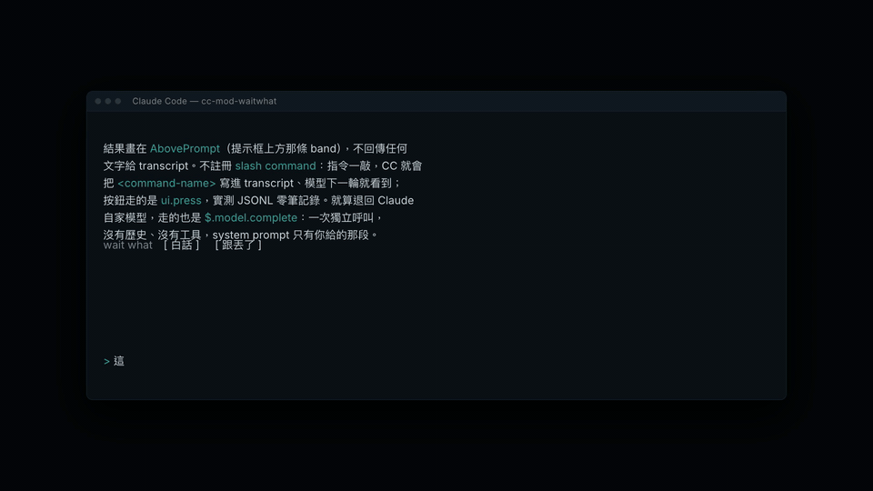

# cc-mod-waitwhat

在 Claude Code 提示框上方放三顆按鈕：重講它剛剛說的話，或提醒你可能漏看的事。內容都不進 transcript，模型看不到。

結果畫在 CC 自己的 pane：終端機夠寬時停在畫面右邊，窄時開在提示框上方。不需要 Herdr。

這是 [cc-sidecar-waitwhat](https://github.com/GGGODLIN/cc-sidecar-waitwhat) 的 Claude Mods 版：sidecar 跑在 CC 外面、讀 JSONL；這個 mod 跑在 CC 裡面、讀引擎給的對話，換來不用切終端機、不用選 session。兩邊共用同一組環境變數與 prompt 覆寫檔。



```
┌ transcript                         ┌ pane（寬終端停右邊）
│  …                                 │ Heads up · 結帳可能重複扣款
├ band                               │ - 測試全過，但沒測重送…
│  [ 白話 ] [ 跟丟了 ] [ 該知道 ● ]   │ 來源 http:gemini-3.8-flash-high
│  recap · 我已修好結帳 → 等你確認     │ [ 有幫助 ] [ 不相關 ]
├ prompt                             └
│  ❯
```

| 按鈕 | 做什麼 | 送什麼給模型 |
|---|---|---|
| `白話` | 看不懂這一輪，白話重講 | 最後一個 turn（你問一次加上 CC 那一輪的全部回應，工具呼叫不拆開算） |
| `跟丟了` | 跟丟了，重講整段脈絡 | 整個 session 的對話與工具紀錄 |
| `該知道` | 看背景檢查挑出的提醒；有新提醒時亮起來、加 `●` | 不用按就會送，見下方「該知道」 |

## 該知道

仿 Claude Code 內建的 You should know mod（`cc-plugin-you-should-know@builtin`），改成走你自己的模型、只在 main 停下來等你時檢查。

| 項目 | 內建版 | 這裡 |
|---|---|---|
| 何時檢查 | main 跑的過程中，每隔幾步一次 | 每一輪結束、閒置 5 秒後一次；輸入框有草稿就跳過 |
| 送什麼 | `$.model.fork`：整段對話原樣、同一個模型，吃 main 的 prompt cache | 整段對話，但每筆工具參數與結果只留頭尾各 300 字、去掉 system-reminder；估算超過 60,000 token 就砍最舊的 |
| 誰判斷 | Claude 官方直連且開 telemetry 的 session 才能用 | 跟重講同一條鏈：`cmd` → `http` → Claude 自家模型；`YSK_MODEL` 可只換「該知道」的 http 模型 |

判斷標準照內建版：預設什麼都不講，只有漏掉會損失錢、時間、白做工、得出錯誤結果時才提醒；你已經在討論或問過的不提；已提醒過的列給模型跳過。提醒分兩種標籤：

- `You should know`：某個系統、概念或設計怎麼運作，而且對你的工作影響很大。
- `Heads up`：這個 session 裡 main 自己做的決定、沒特別講的事、可能有錯的結果，漏掉馬上有代價。

亮起來的提醒沒點開，你再送出兩次 prompt 就自動收掉。pane 裡的 `有幫助`／`不相關` 跟每次檢查的結果都寫進 `~/.cache/cc-ysk-log.jsonl`（留最新 2,000 行），用來判斷這個功能值不值得留：

```json
{"at":1791039533274,"event":"checked","sessionId":"…","source":"cmd:sidecar-webchat","chars":109,"seconds":5.5,"outcome":"none"}
{"at":1791039600000,"event":"answered","sessionId":"…","answer":"helpful","tag":"Heads up","title":"結帳可能重複扣款"}
```

`outcome` 是 `shown`／`none`／`repeat`／`parse_failed`／`error`；`answer` 是 `opened`／`helpful`／`not_relevant`／`ignored`。

## 為什麼模型看不到

- 結果畫在 CC 的 pane，按鈕在 `AbovePrompt`（提示框上方那條 band），都不回傳任何文字給 transcript。
- 不註冊 slash command。`/wait-what` 這類指令一敲，CC 就會把 `<command-name>` 寫進 transcript、模型下一輪就看到；按鈕走的是 `ui.press`，實測 JSONL 零筆記錄。
- 就算退回 Claude 自家模型，走的也是 `$.model.complete`：一次獨立呼叫，沒有歷史、沒有工具，system prompt 只有你給的那段。

## 誰提供這次的重講

跟 sidecar 同一條鏈：先試 `cmd`，不行換 `http`，都不行才退回 Claude 自家模型。每次跑完，標題行會寫實際來源，退回時多一行原因。

| 來源 | 是什麼 | 設定 |
|---|---|---|
| `cmd` | 一個 shell 指令，prompt 從 stdin 進、答案從 stdout 出 | `SIDECAR_CMD`；沒設就跳過 |
| `http` | 任何吃 OpenAI 格式 `/v1/chat/completions` 的端點 | `SIDECAR_PROXY`（預設 `http://127.0.0.1:8317/v1/chat/completions`）、`SIDECAR_MODEL`（預設 `gemini-3.8-flash-high`）、`SIDECAR_API_KEY`（沒設就讀 `~/.cli-proxy-api/config.yaml` 的第一把 `api-keys`） |
| `claude` | `$.model.complete`，走 session 自己的憑證 | `WW_MODEL`（預設 `haiku`） |

`SIDECAR_SOURCE=cmd` 或 `http` 只試那一條，失敗直接退回 `claude`。指令照 shell 規則切參數，但不經過 shell 執行，不能寫 pipe 或重導向。

## 需求

- Claude Code 2.1.288 以上（`$.model.complete` 回傳結果物件、pane 與 `Markdown` 元件），並開 `CLAUDE_CODE_ENABLE_FUNCTION_HOOKS=1`
- 只在 terminal 有效。桌面版和手機版沒有 band。

## 裝

接進所有 session：

```bash
claude plugin marketplace add /path/to/cc-mod-waitwhat
claude plugin install cc-mod-waitwhat@cc-mod-waitwhat --scope user
```

再把 `CLAUDE_CODE_ENABLE_FUNCTION_HOOKS` 放進 `~/.claude/settings.json` 的 `env`：

```json
{ "env": { "CLAUDE_CODE_ENABLE_FUNCTION_HOOKS": "1" } }
```

改了原始碼後跑 `claude plugin update cc-mod-waitwhat@cc-mod-waitwhat`，安裝的是複本。

只試一次、不裝：

```bash
CLAUDE_CODE_ENABLE_FUNCTION_HOOKS=1 claude --plugin-dir /path/to/cc-mod-waitwhat
```

按鈕用滑鼠點，或 `ctrl+x tab` 把焦點移進 band、左右鍵選、Enter 按、Esc 回到輸入框。`ctrl+x ctrl+a` 收合整條 band。

## 自動 recap

每一輪結束後閒置 5 秒，mod 自動寫一份三欄摘要，同一個 session 1 分鐘內最多一次。band 顯示一行 `recap · <now> → <next>`，同一份也寫到 `~/.cache/cc-recap/<session id>.json`，給 [Collie](https://github.com/GGGODLIN/collie) 這類外部畫面讀。

```json
{"version":1,"sessionId":"4114…","at":1790239993523,"model":"groq-gpt-oss-120b",
 "goal":"讀取 hello.txt 並用一句話總結內容","now":"已讀取檔案並完成回答","next":"等待你的下一個指令"}
```

| 項目 | 值 |
|---|---|
| 模型 | `groq-gpt-oss-120b`（`reasoning_effort: low`），失敗退回 `gpt-5.6-luna-fast`，都走 `SIDECAR_PROXY` |
| 送出內容 | 對話尾段，估計 5,000 token 內；`max_tokens` 300；`Request too large` 時砍半重送一次 |
| 跳過 | 對話沒有新內容、輸入框有草稿、`claude -p`、subagent 的回合 |

recap 跟重講一樣不進 transcript，模型看不到；失敗只寫 debug log。

## 快取

重講結果寫進 `~/.cache/cc-sidecar-waitwhat.json`，跟 sidecar 共用同一套 key：模式加上標準化後的 user／assistant 對話，再算 SHA-256。key 不含入口、模型來源或兩邊不同的 payload 包裝，所以按鈕與 terminal `ww` 會互相命中；哪邊先產生答案，另一邊就直接沿用。上限 200 筆、滿了丟最舊的。舊版 key 不搬移，同一段舊對話升級後第一次重看仍會重問一次。

## 換掉 prompt

兩套 system prompt 跟 sidecar 共用同一個覆寫位置：`~/.config/cc-sidecar-waitwhat/wait-what.md`（跟丟了）與 `plain.md`（白話）。檔案存在且非空就用它，否則用內建。

## 開發

```bash
claude plugin validate .claude-plugin/plugin.json   # 列出掛的事件、$ 呼叫、讀的環境變數
```

型別檢查要先在這個資料夾開一個帶 function hooks 的 session、跑 `/plugin-types` 產生 `.claude/types/`，再 `bunx -p typescript tsc -p .`。

用 `--plugin-dir` 跑時改檔會熱重載；裝進 marketplace 的複本要 `claude plugin update`。

會用到 `$` 的函式全放在 `hooks/register.tsx`：validator 只追進同一檔案頂層宣告的函式，`$` 傳進 import 來的函式或巢狀 closure 都會被拒。純函式（組 payload、解析回覆、快取 key）才拆到其他檔案。同一個事件（如 `turn.complete`）也只能不帶 matcher 掛一次，所以 recap 與「該知道」共用同一組 `turn.start`／`turn.complete`。

## License

MIT
